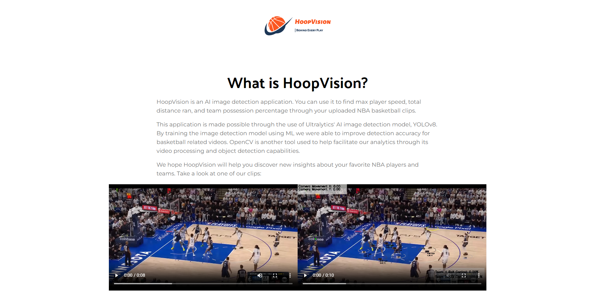
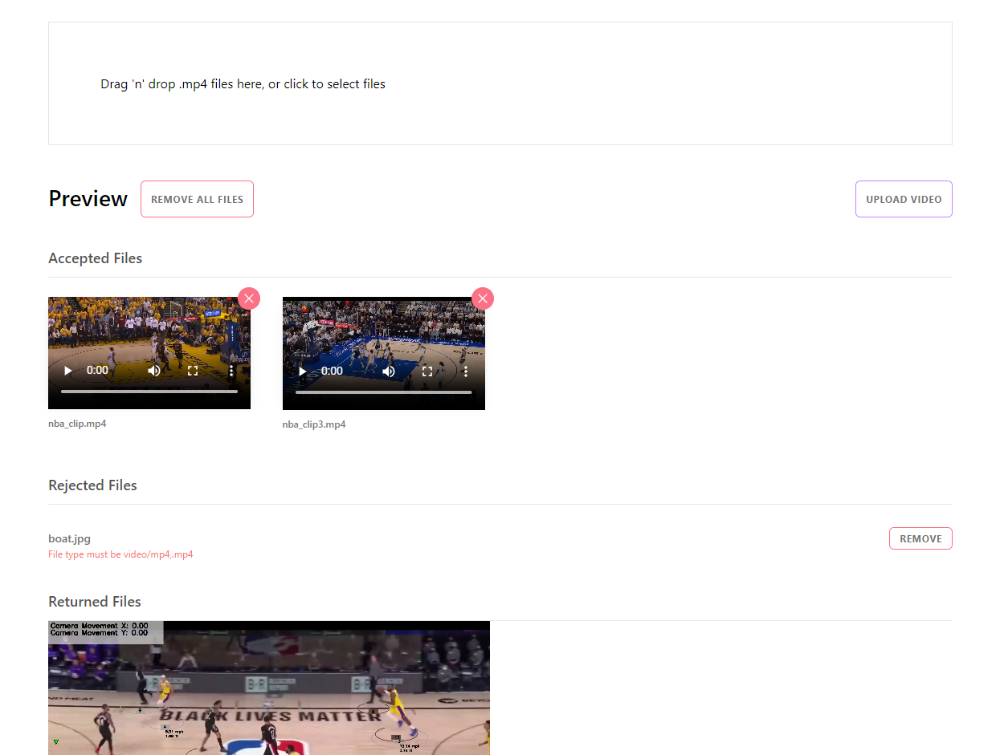

# HoopVision

HoopVision is an AI image detection application. You can use it to find max player speed, total distance ran, and team possession percentage through your uploaded NBA basketball clips.

This application is made possible through the use of Ultralytics' AI
        image detection model, YOLOv8. By training the image detection model
        using ML we were able to improve detection accuracy for basketball
        related videos. OpenCV is another tool used to help facilitate our
        analytics through its video processing and object detection
        capabilities.

<a href="https://app.roboflow.com/test-hgolu/basketball-training-vafot/2">Link to training set.</a>

## <a href="https://hoopvision.onrender.com"> Deployed on Render </a>
_Frontend and Backend are hosted on Render._

## Docker Setup (alternative) ##

    Docker Hub Repository: https://hub.docker.com/repository/docker/stevennguyen22/hoopvision/general
    Have Docker installed 
    Copy the compose.yml file
    In terminal run: 
      docker pull stevennguyen22/hoopvision:frontend
      docker pull stevennguyen22/hoopvision:backend
      docker compose up

Video Demo 

https://github.com/user-attachments/assets/b1a53f83-5bf4-46dc-97ae-d83525507dfb

About Page 
 

File Upload Page 
 

## Tech-Stack

Below is a list of technologies used throughout the project.

<table>
      <thead>
        <tr>
          <th>Frontend</th>
          <th>Backend</th>
          <th>Technologies</th>
        </tr>
      </thead>
      <tbody>
            <tr>
              <td>React.js</td>
              <td>Python</td>
              <td>Docker</td>
            </tr>
            <tr>
              <td>Typescript</td>
              <td>Flask</td>
              <td>Ultralytics</td>
            </tr>
            <tr>
              <td>Tailwind CSS</td>
              <td></td>
              <td>YOLOv8</td>
            </tr>
            <tr>
              <td>Three.js</td>
              <td></td>
              <td>OpenCV</td>
            </tr>
      </tbody>
  </table>
